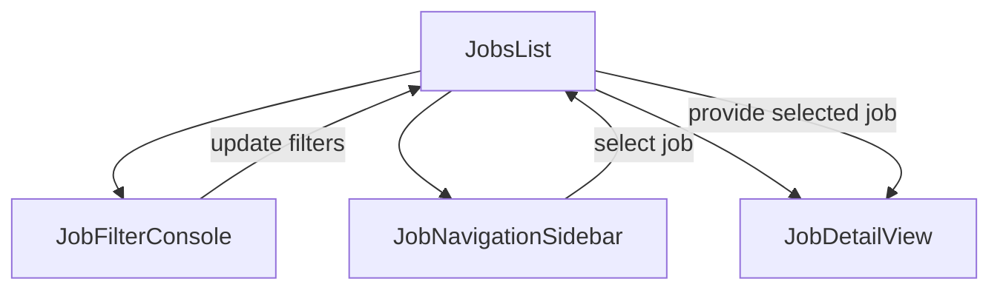

# Design: Master-Detail Layout for Vagas

## Architecture
The refactor follows a **Master-Detail** pattern where the sidebar acts as the "Master" list and the main area acts as the "Detail" view.

### 1. Integrated Filter Console (`JobFilterConsole.tsx`)
-   **Location**: Replaces the current search bar in `JobsList.tsx`.
-   **Structure**:
    -   Row 1: Search Input (Full Width).
    -   Row 2: Location Select | Area Technical (Dropdown) | Environment (Dropdown) | Contract (Dropdown) | Sort Order.
-   **Style**: Balha 9.1 `bg-card`, `border-border`, `rounded-2xl`.

### 2. Job Selection Sidebar (`JobNavigationSidebar.tsx`)
-   **Location**: Left column (sticky).
-   **Content**: Scrollable list of `JobCardCompact`.
-   **Interaction**: Clicking a card updates the `selectedJobId` in `JobsList.tsx` and scrolls the main area to top.
-   **Active State**: Selected card gets a primary border and high-contrast background.

### 3. Job Detail Main Area (`JobDetailView.tsx`)
-   **Location**: Main content area.
-   **Content**: Full job description, requirements, benefits, and "Apply" button.
-   **States**:
    -   `Loading`: Skeleton matching the detail structure.
    -   `Empty`: "Select a job to view details" placeholder.
    -   `Success`: Full job content.

## State Management
In `JobsList.tsx`:
-   `selectedJobId`: `string | null` (defaults to first job in filtered list).
-   `isFilterDrawerOpen`: `boolean` (for mobile).

## Responsive Design
-   **Desktop (>1024px)**: Sidebar (List) + Main (Details).
-   **Tablet/Mobile**: 
    -   List is full width.
    -   Selecting a job opens the detail view in a full-screen drawer or a separate view with a back button.
    -   Filters are accessible via a "Filters" button that opens a sheet.

## Data Flow

